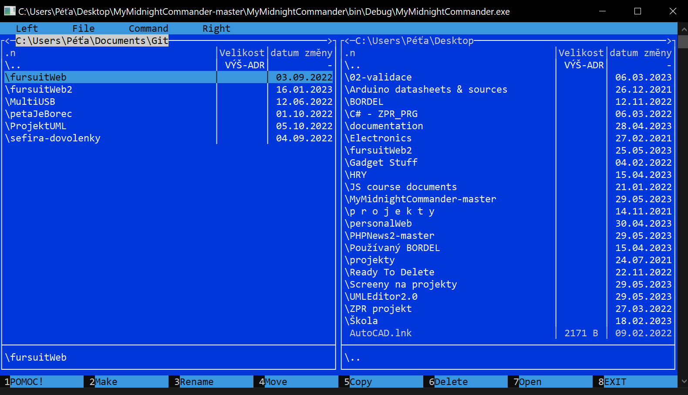
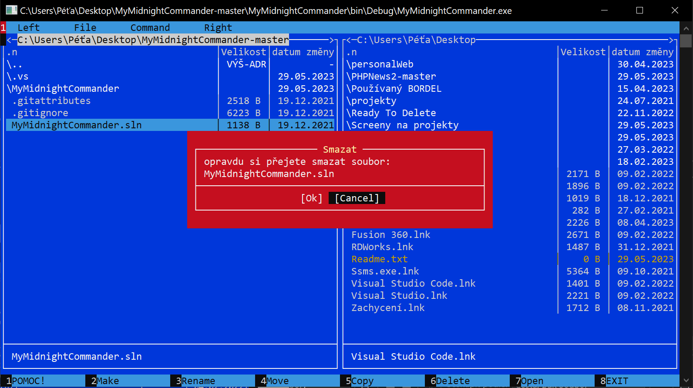
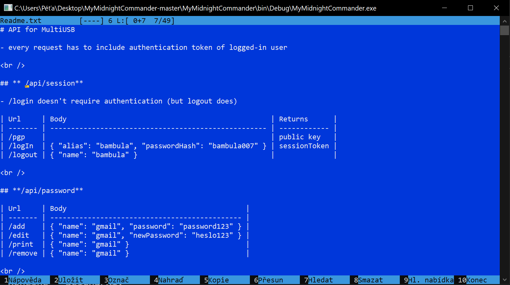

# MyMidnightCommander

A light version of MidnightCommander (file manager) made at school to practice .NET OOP in console   

Supports multiple functions (copy/move/make...) through dialogs. It also supports editor for text files.

  
  

